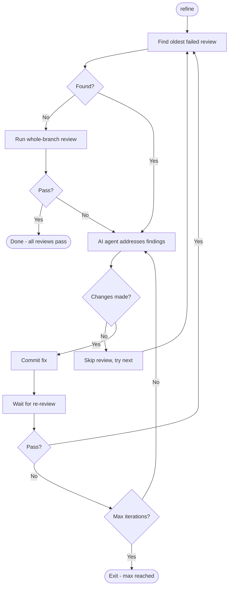

`roborev refine` is a fully automated loop: it finds failed reviews on your
branch, runs an agent to fix them, waits for re-review, and repeats until
everything passes or the iteration limit is reached.

For a one-shot fix without re-review, see
[`roborev fix`](/guides/assisted-refactoring/#using-fix-with-reviews).

!!! tip "Run from an agent session"

    The `/roborev-refine` skill runs the same iterative loop from within a Claude
    Code or Codex session. See
    [Agent Skills](/guides/agent-skills/#refine-a-branch).

!!! tip "Automation inside your coding agent"

    If you want review fixes to happen automatically during your Codex or Claude
    Code sessions — without invoking a command yourself — see
    [Agent Hook](/agent-hook/), which watches the agent boundary and steers the
    agent to fix failed reviews as they appear.

```bash
roborev refine                       # Fix failed reviews using default agent
roborev refine --agent claude-code   # Use specific agent
roborev refine --max-iterations 5    # Limit iterations (default: 10)
roborev refine --quiet               # Show elapsed time instead of agent output
roborev refine --reasoning thorough  # Thorough reasoning (slower, more accurate)
roborev refine --since abc123        # Refine commits since a specific commit
roborev refine --since HEAD~3        # Refine the last 3 commits
roborev refine --list                # Preview which reviews would be refined
roborev refine --all-branches        # Refine all branches with failed reviews
roborev refine --branch feature-xyz  # Validate branch before refining
roborev refine --min-severity high   # Only fix high and critical findings
```

## How It Works



## What Refine Does

1. Finds the **oldest failed review** on your branch
1. Runs an agent in an **isolated worktree** to address the findings
1. If the agent makes changes, applies them and **commits**
1. **Waits for re-review** of the new commit
1. If the new commit fails review, addresses those findings too
1. Once all per-commit reviews pass, runs a **whole-branch review**
1. If the branch review passes, exits successfully
1. If the branch review fails, addresses those findings and loops back

If the agent makes no changes for a review, that review is skipped and refine
moves on to the next failed review.

Refine creates its own commits after applying agent changes. If
`fix_commit_author` or `fix_commit_co_authored_by` is configured, refine applies
those values directly with Git's `--author` and `--trailer` options. See
[Fix Commit Metadata](/configuration/#fix-commit-metadata).

## Refine vs Fix

| | `roborev fix` | `roborev refine` |
|---|---|---|
| **Scope** | One-shot fix, no re-review | Iterative loop with re-review |
| **Commit review** | Enqueues but doesn't wait | Waits and re-addresses if failed |
| **Branch review** | No | Runs after all commits pass |
| **Isolation** | Runs synchronously in the foreground, directly on your working tree | Uses a temp worktree per iteration, commits to your branch when each iteration completes |
| **Use case** | Quick fix for a known issue | Polish a branch before merge |

## Options

| Flag | Description |
|------|-------------|
| `--agent <name>` | Agent to use for fixes |
| `--model <model>` | Model for agent |
| `--max-iterations <n>` | Maximum fix iterations (default: 10) |
| `--quiet` | Show elapsed time instead of agent output |
| `--reasoning <level>` | Legacy or exact reasoning level; see [Reasoning Levels](/configuration/#reasoning-levels) |
| `--fast` | Shorthand for `--reasoning fast` |
| `--since <commit>` | Refine commits since a specific commit |
| `--branch <name>` | Validate the current branch before refining (guardrail, does not switch branches) |
| `--all-branches` | Discover all branches with failed reviews and refine each one in sequence |
| `--list` | List failed reviews that would be refined, without running |
| `--newest-first` | Process newest first (requires `--all-branches` or `--list`) |
| `--allow-unsafe-agents` | Allow agents without sandboxing |
| `--min-severity <level>` | Only fix findings at or above this severity (`low`/`medium`/`high`/`critical`) |

Some flags are mutually exclusive: `--all-branches` cannot be combined with
`--branch` or `--since`, and `--list` cannot be combined with `--since`.

## Targeting

### Single Branch (default)

By default, refine operates on the current feature branch, comparing against the
default branch to find the merge-base.

### Specific Range

Use `--since` to refine commits since a specific point on any branch, including
main:

```bash
roborev refine --since HEAD~3
roborev refine --since v1.0.0
```

### All Branches

Use `--all-branches` to discover every branch with open failed reviews and
refine them in sequence. Refine checks out each branch, runs the loop, then
restores the original branch when finished:

```bash
roborev refine --all-branches
roborev refine --all-branches --newest-first
```

### Preview

Use `--list` to see which reviews would be refined without running any agents:

```bash
roborev refine --list                    # Current branch
roborev refine --list --all-branches     # All branches
roborev refine --list --newest-first     # Newest first
```

### Branch Validation

Use `--branch` as a guardrail to confirm you're on the expected branch before a
long-running refine:

```bash
roborev refine --branch feature-xyz
```

This errors if the current branch doesn't match, preventing accidental
refinement of the wrong branch.

## Severity Filtering

Use `--min-severity` to focus on findings above a certain threshold and skip
low-priority noise:

```bash
roborev refine --min-severity high       # Only fix high and critical findings
roborev refine --min-severity medium     # Skip low-severity findings
roborev refine --min-severity critical   # Only fix critical findings
```

When severity filtering is active and all findings in a review fall below the
threshold, refine automatically closes the review and moves on to the next one
instead of treating it as a fix failure.

You can also set a default per repo in `.roborev.toml`:

```toml
refine_min_severity = "medium"
```

The CLI flag overrides the config value. The severity filter does not apply to
task or analysis jobs, which have free-form output without severity labels.

## Requirements

- **Clean working tree**: No uncommitted changes
- **Feature branch**: By default, compares against the default branch
- **Use `--since`**: To refine specific commits on any branch, including main

## Security Considerations

The refine command runs AI agents **without sandboxing** so they can install
dependencies, run builds, and execute tests. This is safe for your own code, but
use caution with untrusted sources:

| Scenario | Risk Level | Recommendation |
|----------|------------|----------------|
| Your own branches | Low | Safe to run directly |
| PRs from trusted contributors | Low-Medium | Review changes before refining |
| PRs from strangers / untrusted code | High | Use isolation (see below) |

### Isolation Options for Untrusted Code

- Run in a container or VM
- Use a low-privilege user account
- Use a disposable cloud instance

!!! warning

    The risk is equivalent to running `claude --dangerously-skip-permissions` or
    `codex --dangerously-bypass-approvals-and-sandbox` manually - malicious code
    could potentially access credentials, exfiltrate data, or modify your system.

## See Also

- [Assisted Refactoring](/guides/assisted-refactoring/): One-shot fix and
    analysis workflows
- [Consolidating Reviews](/commands/#consolidating-reviews): Verify and
    deduplicate findings before fixing
- [Custom Tasks & Agentic Mode](/advanced/custom-tasks/): Review vs agentic mode
    details
- [Agent Skills](/guides/agent-skills/): Fix findings interactively
